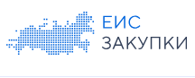
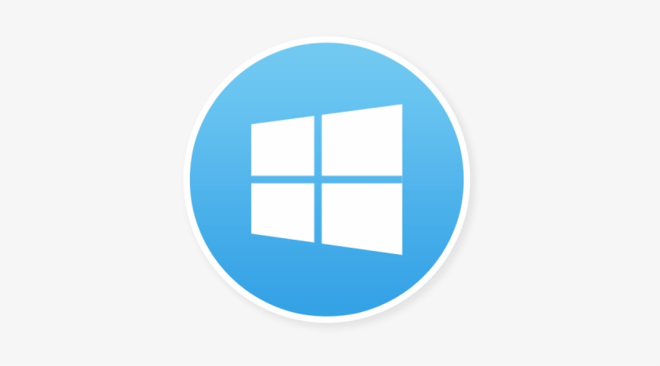
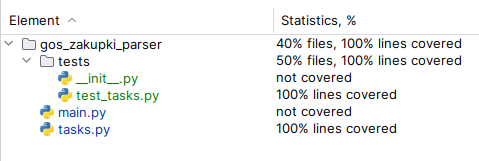

<div style="text-align: center;">

<h1>Парсер сайта государственных закупок (ЕИС)</h1>
</div>
Программа парсит данные сс страниц раздела "Поиск тендеров" 
на сайте Единой информационной системы в сфере закупок (ЕИС)

Парсинг осуществляется для тендеров, относящихся к 44-ФЗ. 
Для каждой записи собирается ссылка на её печатную форму, 
а также дата публикации (поле `publishDTInEIS`) из 
соответствующего XML-документа.

---
## Запуск программы
###  Запуск на Windows (при установленном python):
Открываем терминал, переходим в корневую папку с ботом
1. Создаём окружение ```python -m venv venv```
2. Активируем окружение ```venv\Scripts\activate.bat```
3. Устанавливаем зависимости ```FOR /F %x IN (requirements.txt) DO ( IF NOT # == %x ( pip install %x ) )```
4. Запускаем командой из терминала ```python main.py```

###  Запуск на Linux (при установленном python):
Открываем терминал, переходим в корневую папку с ботом
1. Создаём окружение ```python3 -m venv venv```   
2. Активируем окружение source ```source venv/bin/activate```
3. Устанавливаем зависимости ```pip install -r requirements.txt```
4. Запускаем командой из терминала ```python main.py```

###  Запуск черех docker.
Запуск через Docker-compose:
Открываем терминал, переходим в корневую папку с проектом:

1. Создаём образ командой ```docker-compose -p app_fastapi_postgres build```
2. Поднимаем контейнер ```docker-compose -p app_fastapi_postgres up```


---
### Выходные данные
Результат выводится в консоли в формате:
```
Ссылка на печатную форму — Дата публикации
```

Пример вывода:
```
https://zakupki.gov.ru/epz/order/notice/printForm/viewXml.html?regNumber=0838300001225000003 - 2025-03-06T21:32:03.009+12:00
https://zakupki.gov.ru/epz/order/notice/printForm/viewXml.html?regNumber=0361200001225000031 - 2025-03-06T21:38:05.907+11:00
https://zakupki.gov.ru/epz/order/notice/printForm/viewXml.html?regNumber=0338200002225000092 - 2025-03-06T16:38:27.606+12:00
https://zakupki.gov.ru/epz/order/notice/printForm/viewXml.html?regNumber=0838500000325000004 - 2025-02-25T17:12:09.785+12:00
https://zakupki.gov.ru/epz/order/notice/printForm/viewXml.html?regNumber=0322200001225000204 - 2025-03-03T17:41:54.258+10:00
```
Если поле `publishDTInEIS` отсутствует в XML-файле, будет выведено `None`.

---
###  Тестирование.
Приложение покрыто unit-тестами и проверено линтерами (black, isort, flake8, mypy).



---
<h2>Лицензия</h2>
Проект распространяется под лицензией MIT.